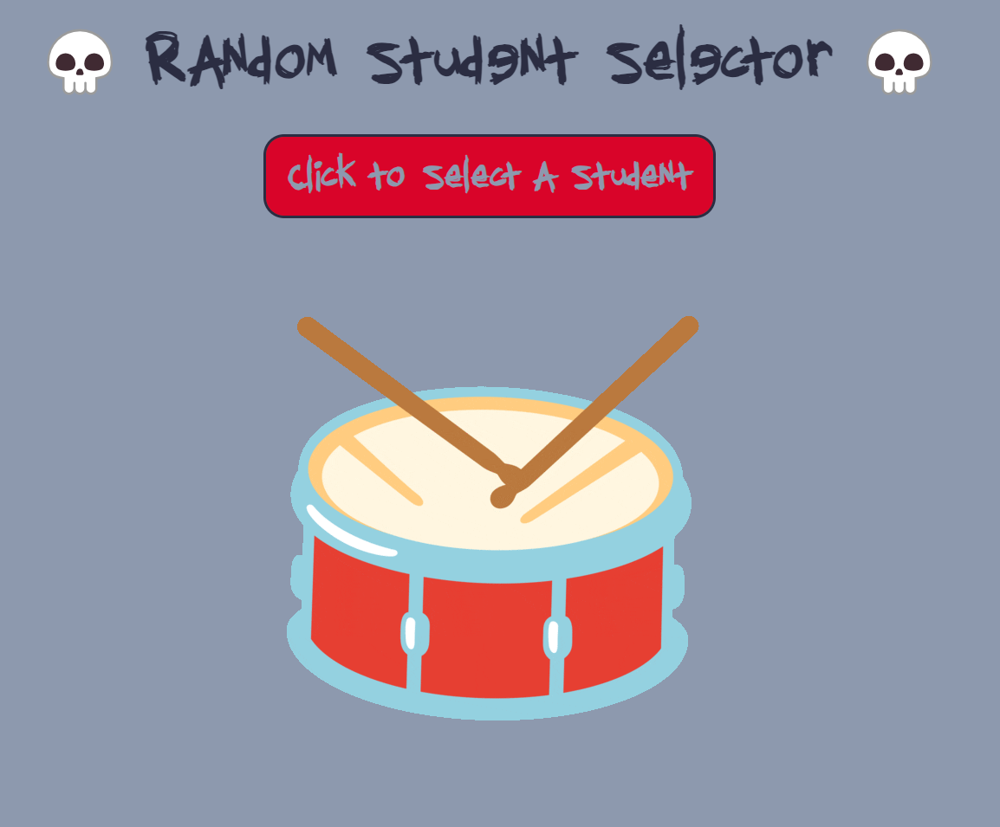

# random-student-selector

## Description

This is a project for UW bootcamp in which we needed a way to randomly select students during class and avoid repeating the same selection until everyone had been called on.

## Installation

N/A

## Usage

On clicking the "Select Random Student" button, a function will run to select a student from the class list. It will then add a count to their called on total, which will prevent them from being called on again. Once every student has been called, the counts reset.

Link to deployed application: https://ktunebe.github.io/random-student-selector/

## Credits

- Fonts
    - "Diediedie" Designed by Mike Emory. ©2001 Static Type Foundry. Downloaded from https://www.1001fonts.com/
    - "Hothead" Hothead © 2002 Brain Eaters Font Company. Downloaded from https://www.1001fonts.com/ 
        File from creators included in assets/fonts folder.

- Color Palette obtained free from https://coolors.co/

## License

N/A